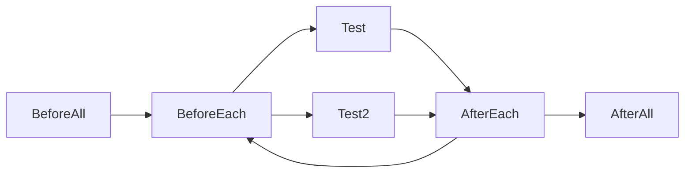
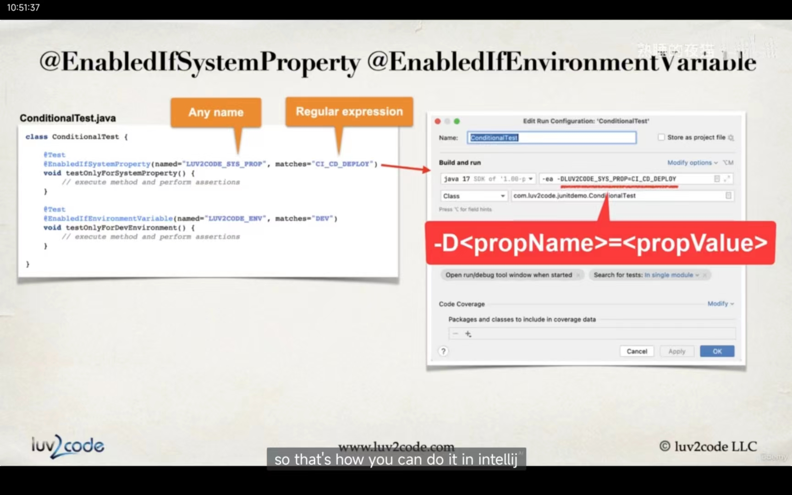
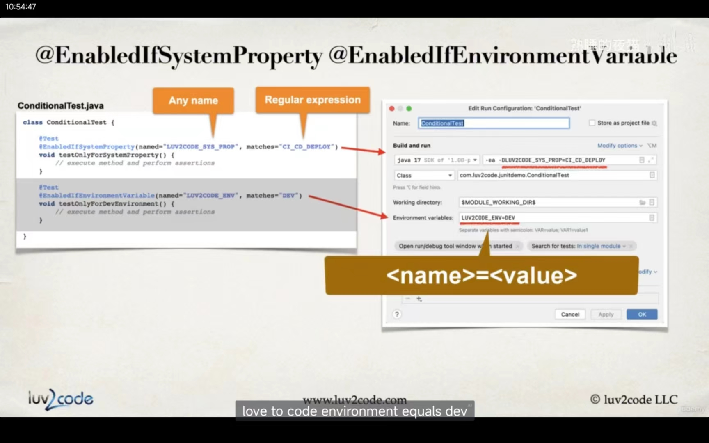

# junit 测试课程学习

[TOC]

> Base on junit 5

## Assertions

### assert that items equals or not

Assertions.assertEquals(expectedValue, actualValueAfterExecutingMethodUnderTest, "optional message if test fails")

Assertions.assertNotEquals(unexpectedValue, actualValueAfterExecutingMethodUnderTest, "optional message if test fails")

### assert that items is null or not

assertNull
AssertNotNull

### assert that items refer to the same object or not, refers to the same object reference

assertSame
assertNotSame

### assert that condition is true or false

assertTrue
assertFalse

### assert array is deeply equals

assertArrayEquals

### assert object iterables are deeply equals

assertIterableEquals

### assert both lists of strings match

assertLinesMatch

### assert that an executable throws an exception of expected type or not

assertThrows
assertDoesNotThrows

### assert that an executable completes before given timeout is exceeded

assertTimeout  断言一段可执行代码的会在指定时间执行结束
assertTimeoutPreemptively  断言可执行代码如果超过指定时间会被抢占中止

assertTimeout和assertTimeoutPreemptively断言的差异在于，
前者会在操作超时后继续执行，并在最终的测试报告中记录操作的超时的时间；
execution exceeded timeout of 2000 ms by 16 ms, 超过预定的2000ms 16ms
后者在到达指定时间后立即结束，在最终的报告中只体现出操作超时，但不包含实际执行的耗时。
execution timed out after 2000 ms

### test order 

@TestMethodOrder
configures the order/sort algorithm for the test methods.

TestMethodOrder can order by following types
DisplayName
MethodName
Random 
OrderAnnotation(sort test methods numerically base on @Order annotation, 
order with the lowest number has the highest priority, negative numbers are allowed, 
if some methods annotated with Order but some not, 
then these methods which annotated with Order will run firstly, other methods will run after them.
if order is duplicated, these test method's order will determined by junit algorithm which is not public.)

alphanumerically 数字字母顺序的 

if you have multiple test classes, you can order the classes.
Define custom order implementation。
Configure default order in properties file.

## lifecycle

@BeforeEach
set up before each test

@AfterEach
clean up after each test


@BeforeAll
One-time set up before all tests
* like get database connections, connect to remote servers

@AfterAll
One-time clean up after all tests
* like release database connections, disconnect from remote servers



> notice: method annotated with BeforeAll or AfterAll must be static

## DisplayName

@DisplayName
Custom display name with spaces, special characters and emojis. 
Useful for test reports in IDE or external test runner
and also for sharing reports with project management and non-techies.

> note: this annotation will also change the test method name which shown in IDEA left panel. 

JUnit can generate display names for you:

Display name generators

* Simple
it just simply remove trailing parentheses ( 圆括号 /pəˈrenθəsiːz/ ) from test method name.
it will also replace underscores, so if a method name has underscores in it, they will be simply replaced with spaces.

* ReplaceUnderscores
replaces underscores in test method name with spaces.

* IndicativeSentences
generate sentence base on test class and test method name.

Indicative 指示的，象征的 /ɪnˈdɪkətɪv/

sample use: just add annotation like this to class

@DisplayNameGeneration(DisplayNameGenerator.Standard.class)

@DisplayNameGeneration(DisplayNameGenerator.ReplaceUnderscores.class)

@DisplayNameGeneration(DisplayNameGenerator.IndicativeSentences.class)

@DisplayNameGeneration(DisplayNameGenerator.Simple.class)

> note: @DisplayName in method will overwrite @DisplayNameGeneration in class, if you add
> @DisplayNameGeneration in class and add @DisplayName in some method, then these methods will 
> show the name you defined in @DisplayName, other methods will show the name generated by @DisplayNameGeneration 

## code coverage

code coverage, which measures how many methods or lines are called by your test.
The coverage is represented as a percentage, such as 50% coverage and so on.
In general, The higher the coverage the better.
On most teams, 70 to 80% is acceptable.
But you have to be careful here.
Code coverage is only a metric and can be easily tricked with bad tests.
Use the metric is simply one data point in your software development process.

### "Run with coverage" in IDEA

green is covered, red is not covered.
"generate coverage report" button in code coverage page.
we can also export test report in coverage run page (this is unit test report), 
which shows test methods pass or not and standard output for each test method.

### show code coverage report using maven command line

It's very useful when running as part of DevOps build process.
Continuous integration(持续集成), Continuous Development(持续部署) (CI/CD) environment.

maven will not find junit5 test classes by default.

#### Configure Maven to find unit test.
We can resolve this by using maven surefire plugin version 2.22.0 or higher.
In our pom file will basically add in this section here for build and will add in plug-in. 

add these to pom.xml

```xml
<build>
    <plugins>
        <plugin>
            <groupId>org.apache.plugins</groupId>
            <artifactId>maven-surefire-plugin</artifactId>
            <version>3.0.0-M5</version>
        </plugin>
    </plugins>
</build>
```

maven.apache.org/plugins

#### run this command:

```shell
mvn clean test
```

#### Add maven surefire-report plugin to generate HTML unit test report.

add these to pom.xml

```xml
<build>
    <plugins>
        <plugin>
            <groupId>org.apache.plugins</groupId>
            <artifactId>maven-surefire-report-plugin</artifactId>
            <version>3.0.0-M5</version>
            
            <executions>
                <execution>
                    <phase>test</phase>
                    <goals>
                        <goal>report</goal>
                    </goals>
                </execution>
            </executions>
        </plugin>
    </plugins>
</build>
```

phase : 阶段

#### generate reports

```shell
# run tests
mvn clean test

# `site` means: add website resources images, css etc...
# `-DgenerateReports=false` means:don't overwrite existing reports 
mvn site -DgenerateReports=false 
```

generated path: target/site/surefire

By default maven surefire plugin will not generate reports if tests fail.

#### to generate report if tests pass or fail

we can add a configuration to set test failure ignore to true, 
so that maven test will continue to execute when some test methods fail and
the test report generated by surefire will contain these failure tests.

add this to pom.xml

```xml
<build>
    <plugins>
        <plugin>
            <groupId>org.apache.maven.plugins</groupId>
            <artifactId>maven-surefire-plugin</artifactId>
            <version>3.0.0</version>
            
            <configuration>
                <testFailureIgnore>true</testFailureIgnore>
            </configuration>
        </plugin>
    </plugins>
</build>
```

By default, maven surefire plugin will not show @DisplayName in reports, Even if you defined it in test classes. 

#### generate reports with display name

details see: https://maven.apache.org/surefire/maven-surefire-plugin/examples/junit-platform.html

add these to pom

```xml

<plugin>
    <groupId>org.apache.maven.plugins</groupId>
    <artifactId>maven-surefire-plugin</artifactId>
    <version>3.1.2</version>

    <configuration>
        <testFailureIgnore>true</testFailureIgnore>
        <statelessTestsetReporter
                implementation="org.apache.maven.plugin.surefire.extensions.junit5.JUnit5Xml30StatelessReporter">
            <usePhrasedTestCaseClassName>true</usePhrasedTestCaseClassName>
            <usePhrasedTestCaseMethodName>true</usePhrasedTestCaseMethodName>
        </statelessTestsetReporter>
    </configuration>
</plugin>
```

#### generate code coverage reports

JaCoCo is free code coverage library.
it provides a maven plugin to generate code coverage reports.

www.jacoco.org

jacoco : JavaCodeCoverage

add this in pom:

```xml
<plugin>
    <groupId>org.jacoco</groupId>
    <artifactId>jacoco-maven-plugin</artifactId>
    <version>0.8.10</version>

    <executions>
        <execution>
            <id>jacoco-prepare</id>
            <goals>
                <goal>prepare-agent</goal>
            </goals>
        </execution>
        
        <execution>
            <id>jacoco-report</id>
            <phase>test</phase>
            <goals>
                <goal>report</goal>
            </goals>
        </execution>
    </executions>
</plugin>
```

generate path: target/site/jacoco/index.xml

## conditional test

some test may run in some condition like running in some java version(like java11 or java17) of running on some os system(like macOS or linux).

> note: The test annotated with these will show in test results as an ignored test if they are not be executed.

@Disable
disable some tests.
this can be used on class or method.
annotate this means that these tests may have some issues or problems that need to be resolved.
So don't Run this test until we resolve these issues.

@EnableOnOs
enable on some os. like OS.Windows, OS.MAC, OS.LINUX. 
this can be used on class or method.
we can use it like @EnableOnOs(OS.MAC) or @EnableOnOs({OS.MAC, OS.LINUX})

@EnabledOnJre
usage: @EnabledOnJre(JRE.JAVA_17)

@EnabledForJreRange
usage: @EnabledForJreRange(min=JRE.JAVA_11, max=JRE.JAVA_17)

@EnabledIfSystemProperty
enable test based on system property
Enable test if system property matches。 We can match system properties using regular expression。 

How to say system properties？ 
we can set -ea -D<PropertyName>=<PropertyValue> for java



@EnabledIfEnvironmentVariable
Enable test based on environment variable。 
Enable test if environment variable matches. We can match environment variable using regular expression.

How to set environmental variables?
we can set <name>=<value> for Environment variables.


