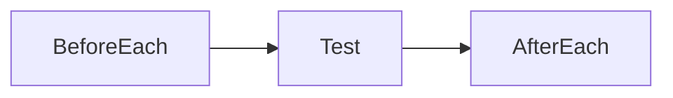
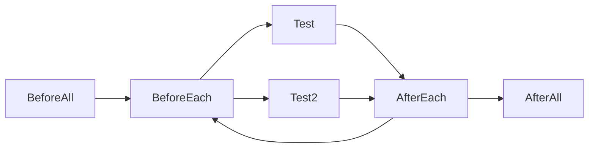

# junit 测试课程学习

> Base on junit 5

## Assertions

### assert that items equals or not

Assertions.assertEquals(expectedValue, actualValueAfterExecutingMethodUnderTest, "optional message if test fails")

Assertions.assertNotEquals(unexpectedValue, actualValueAfterExecutingMethodUnderTest, "optional message if test fails")

### assert that items is null or not

assertNull
AssertNotNull

### assert that items refer to the same object or not, refers to the same object reference

assertSame
assertNotSame

### assert that condition is true or false

assertTrue
assertFalse

### assert array is deeply equals

assertArrayEquals

### assert object iterables are deeply equals

assertIterableEquals

### assert both lists of strings match

assertLinesMatch

## lifecycle

@BeforeEach
set up before each test

@AfterEach
clean up after each test

@BeforeAll
One-time set up before all tests
* like get database connections, connect to remote servers

@AfterAll
One-time clean up after all tests
* like release database connections, disconnect from remote servers

> notice: method annotated with BeforeAll or AfterAll must be static

## DisplayName

@DisplayName
Custom display name with spaces, special characters and emojis. 
Useful for test reports in IDE or external test runner
and also for sharing reports with project management and non techies.

> note: this annotation will also change the test method name which shown in IDEA left panel. 

JUnit can generate display names for you:

Display name generators

* Simple
it just simply remove trailing parentheses ( 圆括号 /pəˈrenθəsiːz/ ) from test method name.
it will also replace underscores, so if a method name has underscores in it, they will be simply replaced with spaces.

* ReplaceUnderscores
replaces underscores in test method name with spaces.

* IndicativeSentences
generate sentence base on test class and test method name.

Indicative 指示的，象征的 /ɪnˈdɪkətɪv/

sample use: just add annotation like this to class

@DisplayNameGeneration(DisplayNameGenerator.Standard.class)

@DisplayNameGeneration(DisplayNameGenerator.ReplaceUnderscores.class)

@DisplayNameGeneration(DisplayNameGenerator.IndicativeSentences.class)

@DisplayNameGeneration(DisplayNameGenerator.Simple.class)

> note: @DisplayName in method will overwrite @DisplayNameGeneration in class, if you add
> @DisplayNameGeneration in class and add @DisplayName in some method, then these methods will 
> show the name you defined in @DisplayName, other methods will show the name generated by @DisplayNameGeneration 

