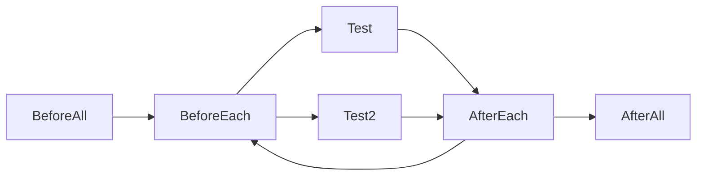

# junit 测试课程学习

> Base on junit 5

## Assertions

Assertions.assertEquals(expectedValue, actualValueAfterExecutingMethodUnderTest, "optional message if test fails")

Assertions.assertNotEquals(unexpectedValue, actualValueAfterExecutingMethodUnderTest, "optional message if test fails")

assertNull
AssertNotNull

## lifecycle

@BeforeEach
set up before each test

@AfterEach
clean up after each test

@BeforeAll
One-time set up before all tests
* like get database connections, connect to remote servers

@AfterAll
One-time clean up after all tests
* like release database connections, disconnect from remote servers

